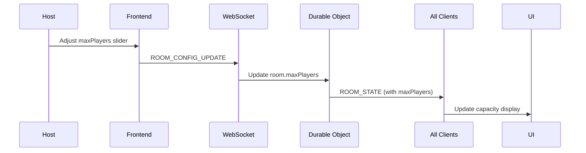
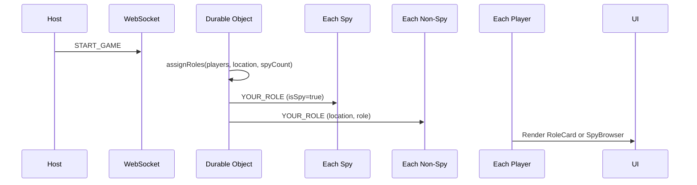
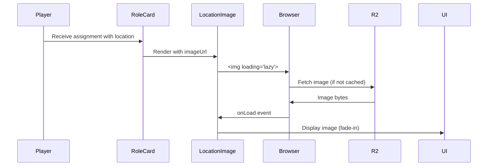
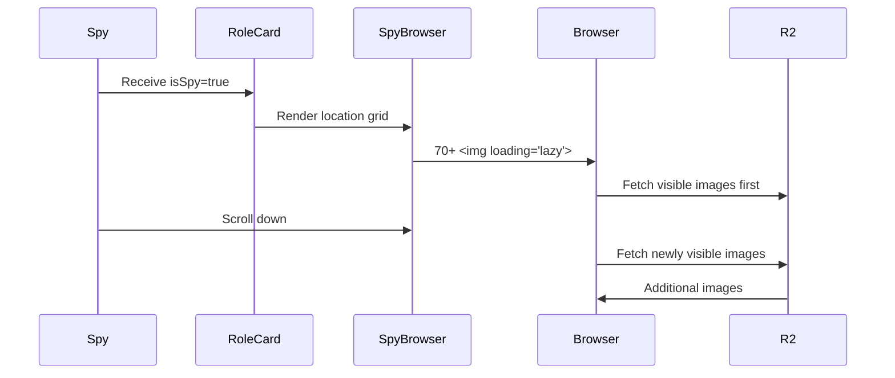

# Data Model: Location Images & Player Scaling

**Phase**: 1 (Design & Contracts)  
**Date**: 2025-10-28  
**Purpose**: Define data structures and state management for new features

## Core Entities

### 1. Room Configuration (Extended)

Represents room-level settings for player capacity and spy configuration.

**TypeScript Definition**:

```typescript
interface RoomConfig {
  maxPlayers: number; // 4-20, default: 10
  spyCount: number; // 1-3, default: 1
  minPlayers: number; // Always 4 (constant)
  createdAt: number; // Timestamp
  updatedAt: number; // Timestamp for config changes
}
```

**Validation Rules** (from FR-013, FR-014, FR-018, FR-021):

- `maxPlayers` MUST be between 4 and 20 (inclusive)
- `spyCount` MUST be between 1 and 3 (inclusive)
- `spyCount * 3 <= totalPlayers` (minimum 3:1 ratio for game balance)
- `maxPlayers` cannot be reduced below current player count

**State Transitions**:

```
[Initial] → maxPlayers=10, spyCount=1
    ↓
[Host Config] → maxPlayers=4-20, spyCount=1-3 (in lobby only)
    ↓
[Game Started] → Config locked (cannot change during active game)
    ↓
[Game Ended] → Config unlocked (can modify for next round)
```

**Relationships**:

- Owned by: Room (1:1)
- Used by: GameState (for role assignment)

---

### 2. Room State (Modified)

Extended existing Room model with new configuration fields.

**TypeScript Definition**:

```typescript
interface Room {
  // Existing fields (unchanged)
  code: string;
  hostPlayerId: string;
  gameType: 'spyfall';
  phase: 'lobby' | 'playing' | 'voting' | 'spy_guess' | 'results';
  createdAt: number;

  // NEW: Player capacity configuration
  maxPlayers: number; // Default: 10 for backward compat
  currentPlayerCount: number; // Computed from players.size

  // NEW: Spy configuration
  spyCount: number; // Default: 1 for backward compat
}
```

**Validation Rules**:

- When player joins: `currentPlayerCount < maxPlayers` (FR-015)
- When host reduces capacity: `maxPlayers >= currentPlayerCount` (FR-016)
- When starting game: `currentPlayerCount >= 4` (FR-018)
- When setting spy count: `spyCount * 3 <= currentPlayerCount` (FR-021)

**Computed Properties**:

```typescript
// Capacity status
isFull: boolean = currentPlayerCount >= maxPlayers;
canStart: boolean = currentPlayerCount >= 4 && currentPlayerCount >= spyCount * 3;
capacityDisplay: string = `${currentPlayerCount}/${maxPlayers} players`;
```

---

### 3. Game State (Modified)

Extended for multi-spy support and large group role assignment.

**TypeScript Definition**:

```typescript
interface GameState {
  // Existing fields (unchanged)
  locationId: string;
  startedAt: number;
  timerDuration: number;
  timerRemaining: number;
  currentTurn: number;

  // MODIFIED: Multiple spies support
  spyPlayerIds: string[]; // Changed from single spyPlayerId to array

  // NEW: Role assignments for all players
  assignments: Map<string, Assignment>;
}

interface Assignment {
  playerId: string;
  isSpy: boolean;
  location?: string; // null for spies
  role?: string; // null for spies
  isDuplicateRole?: boolean; // true if location had fewer roles than players
}
```

**Assignment Algorithm** (from FR-022, FR-025, FR-026):

```typescript
function assignRoles(
  playerIds: string[],
  location: Location,
  spyCount: number
): Map<string, Assignment> {
  // 1. Shuffle players for fairness
  const shuffled = shuffleArray([...playerIds]);

  // 2. Select spies
  const spyIds = shuffled.slice(0, spyCount);
  const nonSpyIds = shuffled.slice(spyCount);

  // 3. Assign roles to non-spies
  const assignments = new Map<string, Assignment>();

  // Spies get no location/role
  spyIds.forEach((id) => {
    assignments.set(id, {
      playerId: id,
      isSpy: true,
    });
  });

  // Non-spies get location + role
  nonSpyIds.forEach((id, index) => {
    const roleIndex = index % location.roles.length;
    assignments.set(id, {
      playerId: id,
      isSpy: false,
      location: location.nameTh,
      role: location.roles[roleIndex],
      isDuplicateRole: roleIndex < nonSpyIds.length - location.roles.length,
    });
  });

  return assignments;
}
```

**State Transitions**:

```
[Game Start] → Assign spyCount random spies
    ↓
[Role Assignment] → Distribute location roles to non-spies
    ↓
[Playing] → Players reference their assignments
    ↓
[Voting] → Check if all spies eliminated
    ↓
[Spy Guess] → If any spy survives, allow location guess
    ↓
[Scoring] → Award points based on outcome
```

---

### 4. Location Image Metadata (No Changes)

Existing location data already includes image URLs.

**TypeScript Definition** (from `lib/types.ts`):

```typescript
interface Location {
  id: string;
  nameTh: string;
  difficulty: 'easy' | 'medium' | 'hard';
  roles: string[]; // 7-19 roles per location
  imageUrl: string; // Already on R2, e.g., "https://spyfall-asset.greenrenge.work/loc-*.png"
}
```

**No modifications needed** - existing 70+ locations all have `imageUrl` field pointing to R2 bucket.

---

### 5. Player (Minimal Changes)

Existing Player model requires no structural changes.

**TypeScript Definition**:

```typescript
interface Player {
  id: string;
  name: string;
  isHost: boolean;
  isConnected: boolean;
  joinedAt: number;
  lastSeenAt: number;
  score: number;
}
```

**Note**: Player role assignment moved to GameState.assignments map (better separation of concerns).

---

### 6. Image Display State (Frontend Only)

Client-side state for image loading and caching.

**TypeScript Definition**:

```typescript
// Component-level state (not persisted)
interface ImageState {
  status: 'loading' | 'loaded' | 'error';
  src: string;
  cachedAt?: number;
}

// Browser cache handled automatically via:
// - HTTP Cache-Control headers (from R2)
// - Browser's native img cache
// No custom cache implementation needed
```

---

## Data Flow

### Player Capacity Configuration



### Role Assignment with Multiple Spies



### Image Loading for Non-Spy



### Image Browsing for Spy



---

## Storage & Persistence

### Durable Objects (Backend)

**Storage Location**: Cloudflare Durable Objects SQLite

**Persisted Fields**:

```typescript
{
  room: {
    code: string,
    hostPlayerId: string,
    gameType: string,
    phase: string,
    maxPlayers: number,      // NEW
    spyCount: number         // NEW
  },
  players: Map<string, Player>,
  gameState: {
    locationId: string,
    spyPlayerIds: string[],  // MODIFIED to array
    assignments: Object      // NEW
  }
}
```

**Migration Strategy**:

- Existing rooms without `maxPlayers`: default to 10
- Existing rooms without `spyCount`: default to 1
- Existing `spyPlayerId`: convert to `spyPlayerIds: [spyPlayerId]`
- No database migration scripts needed (Durable Objects handle undefined gracefully)

### R2 Bucket (Images)

**Storage Location**: Cloudflare R2 bucket `spyfall-assets`

**Existing Structure**:

```
spyfall-assets/
├── loc-local-market.png
├── loc-hospital.png
├── loc-school.png
└── ... (70+ location images)
```

**No changes needed** - images already uploaded, URLs in `data/locations.json`

### D1 Database (Locations)

**Storage Location**: Cloudflare D1 database `spyfall-locations`

**Existing Table**:

```sql
CREATE TABLE locations (
  id TEXT PRIMARY KEY,
  name_th TEXT NOT NULL,
  difficulty TEXT NOT NULL,
  roles TEXT NOT NULL,  -- JSON array
  image_url TEXT NOT NULL
);
```

**No changes needed** - schema already supports image URLs

---

## Validation Summary

All functional requirements mapped to data model:

| Requirement      | Entity          | Field/Method                               |
| ---------------- | --------------- | ------------------------------------------ |
| FR-001 to FR-006 | ImageState      | status, aspect-ratio CSS                   |
| FR-007 to FR-012 | Assignment      | isSpy, location, role                      |
| FR-013 to FR-018 | Room            | maxPlayers, currentPlayerCount, validation |
| FR-019 to FR-024 | Room, GameState | spyCount, spyPlayerIds[], assignments      |
| FR-025 to FR-028 | GameState       | assignRoles() with modulo distribution     |
| FR-029 to FR-032 | GameState       | Scoring logic with spyPlayerIds.length     |

**No NEEDS CLARIFICATION items** - all entities and relationships defined.
